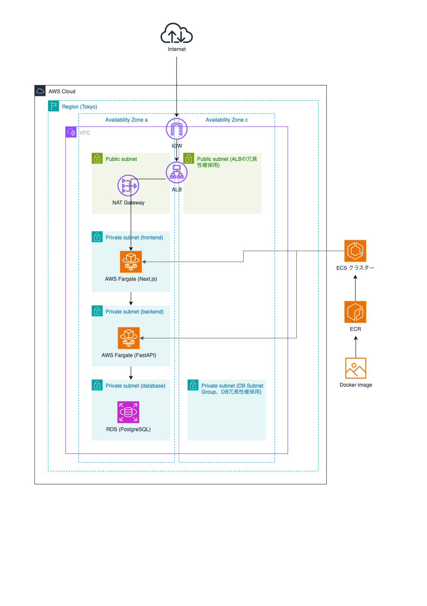

# AWS デプロイメントガイド

## 📋 概要

このガイドでは、Next.js フロントエンド、FastAPI バックエンド、PostgreSQL データベースを AWS 上に 3 層アーキテクチャでデプロイする方法を詳しく説明します。

## 🎯 全体概要

本プロジェクトでは、AWS 上で Fargate ベースの ECS アプリケーションを構築し、セキュアで可用性の高い 3 層アーキテクチャを実装します。

### 主要コンポーネント

- **VPC**: 独立したネットワーク環境を提供
- **ECS Fargate**: コンテナ化されたアプリケーションの実行環境
- **Application Load Balancer (ALB)**: トラフィックの分散と SSL/TLS 終端
- **Amazon RDS**: PostgreSQL マネージドデータベース
- **NAT Gateway**: プライベートサブネットからのインターネットアクセス
- **CloudWatch**: ログとメトリクスの監視

### アーキテクチャの特徴

- **セキュリティ**: 3 層分離によるセキュリティ境界の確立
- **可用性**: 複数 AZ にわたるリソース配置
- **スケーラビリティ**: ECS Fargate による自動スケーリング対応
- **監視**: CloudWatch による包括的なメトリクス収集

## 🏆 アーキテクチャ選定理由

### 1. 技術選択の背景

#### 1.1 プロジェクト要件

- **アプリケーション構成**: Next.js + FastAPI + PostgreSQL
- **開発期間**: 3 ヶ月間（短期プロジェクト）
- **開発形態**: 個人開発・学習目的
- **運用規模**: 小〜中規模（練習用）
- **予算制約**: AWS Free Tier 活用が望ましい

#### 1.2 技術的要件

- **コンテナ化**: 開発環境と本番環境の一致
- **スケーラビリティ**: 将来的な負荷増加への対応
- **セキュリティ**: 企業レベルのセキュリティ実装の学習
- **可用性**: 商用レベルの可用性設計の理解
- **Infrastructure as Code**: 再現可能なインフラ構築

### 2. AWS サービス選定理由

#### 2.1 ECS Fargate vs EC2 vs Lambda

**ECS Fargate を選択した理由**：

| 項目                 | ECS Fargate   | EC2         | Lambda      |
| -------------------- | ------------- | ----------- | ----------- |
| **インフラ管理**     | ✅ 不要       | ❌ 必要     | ✅ 不要     |
| **コンテナサポート** | ✅ ネイティブ | ⚠️ 設定必要 | ❌ 制限あり |
| **学習コスト**       | ⚠️ 中程度     | ❌ 高い     | ✅ 低い     |
| **本番環境との近さ** | ✅ 高い       | ✅ 高い     | ⚠️ 中程度   |
| **コスト効率**       | ✅ 従量課金   | ❌ 固定費   | ✅ 従量課金 |
| **スケーラビリティ** | ✅ 柔軟       | ⚠️ 手動     | ✅ 自動     |

**選定理由**：

- **学習効果**: コンテナオーケストレーションの実践的学習
- **運用負荷**: サーバー管理不要で開発に集中可能
- **実践性**: 多くの企業で採用されている技術スタック
- **コスト**: 使用量に応じた課金で練習用に適している

#### 2.2 RDS vs Aurora vs DocumentDB

**RDS PostgreSQL を選択した理由**：

| 項目             | RDS PostgreSQL | Aurora      | DocumentDB |
| ---------------- | -------------- | ----------- | ---------- |
| **Free Tier**    | ✅ 対応        | ❌ 非対応   | ❌ 非対応  |
| **学習コスト**   | ✅ 低い        | ⚠️ 中程度   | ⚠️ 中程度  |
| **アプリ互換性** | ✅ 完全互換    | ✅ 互換     | ❌ NoSQL   |
| **運用コスト**   | ✅ 低い        | ❌ 高い     | ⚠️ 中程度  |
| **可用性**       | ⚠️ Single-AZ   | ✅ Multi-AZ | ✅ 高い    |

**選定理由**：

- **予算制約**: Free Tier での学習が可能
- **技術親和性**: PostgreSQL での開発経験活用
- **シンプルさ**: 学習段階では複雑さを避けて基本を理解

#### 2.3 ALB vs NLB vs CloudFront + ALB

**Application Load Balancer (ALB) を選択した理由**：

| 項目                       | ALB           | NLB         | CloudFront + ALB |
| -------------------------- | ------------- | ----------- | ---------------- |
| **HTTP/HTTPS 対応**        | ✅ ネイティブ | ❌ 制限あり | ✅ 対応          |
| **SSL 終端**               | ✅ 対応       | ✅ 対応     | ✅ 対応          |
| **パスベースルーティング** | ✅ 対応       | ❌ 非対応   | ✅ 対応          |
| **設定複雑度**             | ✅ シンプル   | ✅ シンプル | ❌ 複雑          |
| **コスト**                 | ✅ 適正       | ✅ 適正     | ❌ 高い          |

**選定理由**：

- **機能要件**: HTTP/HTTPS とパスベースルーティングが必要
- **学習効果**: L7 ロードバランサーの理解
- **コスト効率**: CDN 不要な規模での最適選択

### 3. ネットワーク設計の選定理由

#### 3.1 3 層アーキテクチャの採用

**Web 層 (Public) → App 層 (Private) → DB 層 (Private)**

**選定理由**：

- **セキュリティ原則**: Defense in Depth (多層防御)
- **責任分離**: 各層の役割を明確に分離
- **スケーラビリティ**: 各層を独立してスケール可能
- **業界標準**: エンタープライズ環境でのベストプラクティス

#### 3.2 プライベートサブネット中心設計

**なぜアプリケーションをプライベートサブネットに配置？**

| アプローチ               | セキュリティ | 複雑度    | コスト      | 学習効果 |
| ------------------------ | ------------ | --------- | ----------- | -------- |
| **Private Subnet + NAT** | ✅ 高い      | ⚠️ 中程度 | ❌ NAT 料金 | ✅ 高い  |
| Public Subnet 直配置     | ❌ 低い      | ✅ 低い   | ✅ 低い     | ❌ 低い  |

**選定理由**：

- **セキュリティ学習**: プロダクション環境でのセキュリティ実装
- **実践性**: 実際の企業環境により近い構成
- **攻撃面縮小**: 直接インターネットアクセス不可

#### 3.3 マルチ AZ 配置の部分採用

**現在の構成**: RDS 用のマルチ AZ、ECS 用は単一 AZ

**選定理由**：

- **学習目的**: マルチ AZ の概念理解
- **コスト制約**: 全面マルチ AZ は予算超過リスク
- **データ保護**: データベースの可用性は最優先
- **段階的拡張**: 将来的なマルチ AZ 化の準備

### 4. セキュリティ設計の選定理由

#### 4.1 Security Group による細かな制御

**レイヤー別のセキュリティグループ設計**

```
Internet → ALB SG (80,443) → Frontend SG (3000) → Backend SG (8000) → RDS SG (5432)
```

**選定理由**：

- **最小権限原則**: 必要最小限のポートのみ開放
- **トレーサビリティ**: 通信経路の明確化
- **障害切り分け**: 問題発生時の原因特定が容易
- **学習効果**: ネットワークセキュリティの実践的理解

#### 4.2 SSL/TLS 終端を ALB で実装

**ALB → コンテナ間は HTTP 通信**

**選定理由**：

- **パフォーマンス**: SSL 処理を ALB に集約
- **証明書管理**: ACM による自動化
- **設定簡素化**: コンテナ内での SSL 設定不要
- **コスト効率**: 追加の SSL 処理リソース不要

### 5. Infrastructure as Code (Terraform) の選定理由

#### 5.1 Terraform vs CloudFormation vs AWS CDK

**Terraform を選択した理由**：

| 項目               | Terraform     | CloudFormation | AWS CDK       |
| ------------------ | ------------- | -------------- | ------------- |
| **学習効果**       | ✅ 汎用性高い | ⚠️ AWS 特化    | ⚠️ 開発者向け |
| **業界採用度**     | ✅ 高い       | ⚠️ AWS 内限定  | ⚠️ 新しい     |
| **記述方式**       | ✅ 宣言的     | ✅ 宣言的      | ❌ 命令的     |
| **学習コスト**     | ⚠️ 中程度     | ⚠️ 中程度      | ❌ 高い       |
| **マルチクラウド** | ✅ 対応       | ❌ AWS 専用    | ❌ AWS 専用   |

**選定理由**：

- **キャリア価値**: Terraform スキルの汎用性
- **学習効果**: Infrastructure as Code の基本概念習得
- **実践性**: 多くの企業でのスタンダード

#### 5.2 ローカル State 管理の採用

**S3 + DynamoDB vs ローカル State**

**ローカル State を選択した理由**：

- **学習段階**: 基本概念の理解を優先
- **プロジェクト期間**: 3 ヶ月の短期プロジェクト
- **個人開発**: チーム開発での State 共有不要
- **シンプルさ**: 複雑な仕組みを避けて本質に集中

### 6. 監視・ログ設計の選定理由

#### 6.1 CloudWatch 中心の監視

**CloudWatch vs サードパーティツール**

**CloudWatch 選択理由**：

- **統合性**: AWS サービスとのネイティブ統合
- **学習効果**: AWS の標準的な監視方法の習得
- **コスト**: 基本的な監視は低コスト
- **設定簡素化**: 追加インフラ不要

#### 6.2 ログ保持期間の短期設定（7 日）

**選定理由**：

- **コスト最適化**: 練習用途での課金抑制
- **学習焦点**: ログ機能の理解が主目的
- **実践準備**: 本番環境では延長可能な設計

### 7. 将来的な拡張性への配慮

#### 7.1 段階的な拡張可能性

**現在の構成から将来への拡張パス**：

```
現在: Single-AZ → 将来: Multi-AZ
現在: ローカルState → 将来: リモートState
現在: 基本監視 → 将来: 高度な監視・アラート
現在: 手動デプロイ → 将来: CI/CDパイプライン
```

#### 7.2 モジュラー設計の採用

**Terraform モジュール分割**：

- **network/**: VPC、サブネット関連
- **security/**: セキュリティグループ
- **ecs/**: コンテナ関連
- **rds/**: データベース関連
- **alb/**: ロードバランサー関連

**選定理由**：

- **再利用性**: 他プロジェクトでの活用
- **保守性**: 変更影響範囲の局所化
- **学習効果**: モジュール設計パターンの理解

### 8. コスト最適化の考慮

#### 8.1 Free Tier 最大活用

**Free Tier 対象サービスの積極活用**：

- RDS t3.micro (20GB)
- ECS Fargate (限定使用量)
- CloudWatch (基本メトリクス)
- Route53 (最初の Hosted Zone)

#### 8.2 従量課金サービスの選択

**固定費 vs 従量課金**：

- ECS Fargate: 実行時間課金
- NAT Gateway: データ転送量課金
- ALB: 処理リクエスト課金

**選定理由**：

- **学習段階**: 使用量が予測できない
- **コスト制御**: 使わない時間の課金回避
- **実験的利用**: 様々な設定での試行錯誤

### 9. この設計から得られる学習効果

#### 9.1 技術的学習効果

- **コンテナオーケストレーション**: ECS/Fargate の実践
- **ネットワーク設計**: VPC、サブネット、ルーティング
- **セキュリティ設計**: Security Group、SSL/TLS
- **Infrastructure as Code**: Terraform 実践
- **AWS サービス統合**: 複数サービスの連携

#### 9.2 運用・保守の学習効果

- **監視・ログ管理**: CloudWatch 活用
- **トラブルシューティング**: 問題切り分け手法
- **スケーリング**: 負荷対応の基本概念
- **セキュリティ運用**: アクセス制御の実装

#### 9.3 キャリア開発への貢献

- **クラウドアーキテクト**: 設計思想の理解
- **DevOps エンジニア**: 自動化・コード化の実践
- **インフラエンジニア**: モダンインフラの経験
- **フルスタック開発**: インフラ込みの全体理解

### 10. 代替案との比較

#### 10.1 より簡単なアプローチ

- **Elastic Beanstalk**: 設定簡単だが学習効果低い
- **App Runner**: 管理不要だが制御できない部分多い
- **EC2 直配置**: シンプルだがモダンでない

#### 10.2 より高度なアプローチ

- **EKS**: Kubernetes だが複雑すぎる
- **Aurora Serverless**: 高機能だが高コスト
- **マイクロサービス**: 過剰な複雑さ

**現在の選択が最適な理由**：

- 学習効果と実用性のバランス
- コストと機能のバランス
- 複雑さと理解度のバランス

## 🎯 まとめ

この 3 層アーキテクチャは、**学習効果**、**実践性**、**コスト効率**、**将来性**のバランスを考慮して設計されています。

**核心的な価値**：

1. **エンタープライズレベル**のセキュリティ・可用性設計の理解
2. **Infrastructure as Code**による再現可能なインフラ構築
3. **コンテナ化技術**の実践的な習得
4. **AWS クラウドサービス**の統合的な活用
5. **段階的拡張**可能な設計パターンの実装

## 🏗️ アーキテクチャ構成

```
                           ┌─────────────────────────────────────┐
                           │              Internet               │
                           └─────────────────┬───────────────────┘
                                             │
                           ┌─────────────────┴───────────────────┐
                           │         Internet Gateway           │
                           └─────────────────┬───────────────────┘
                                             │
    ┌──────────────────────────────────────┐ │ ┌─────────────────────────────────────┐
    │            VPC (10.0.0.0/16)         │ │ │                                     │
    │                                      │ │ │                                     │
    │  ┌─────────────────────────────────┐ │ │ │ ┌─────────────────────────────────┐ │
    │  │         Public Subnet 1         │ │ │ │ │         Public Subnet 2         │ │
    │  │        (10.0.1.0/24)           │ │ │ │ │        (10.0.5.0/24)           │ │
    │  │  ┌───────────┐ ┌──────────────┐ │ │ │ │ │                                 │ │
    │  │  │    ALB    │ │ NAT Gateway  │ │ │ │ │ │                                 │ │
    │  │  └─────┬─────┘ └──────────────┘ │ │ │ │ │                                 │ │
    │  └────────┼─────────────────────────┘ │ │ │ └─────────────────────────────────┘ │
    │           │                           │ │ │                                     │
    │           ▼                           │ │ │                                     │
    │  ┌────────┴─────────────────────────┐ │ │ │                                     │
    │  │      Private Subnet (Web)        │ │ │ │                                     │
    │  │        (10.0.2.0/24)            │ │ │ │                                     │
    │  │  ┌────────────────────────────┐  │ │ │ │                                     │
    │  │  │      Frontend ECS          │  │ │ │ │                                     │
    │  │  │       (Next.js)            │  │ │ │ │                                     │
    │  │  └────────────┬───────────────┘  │ │ │ │                                     │
    │  └───────────────┼──────────────────┘ │ │ │                                     │
    │                  │                    │ │ │                                     │
    │                  ▼                    │ │ │                                     │
    │  ┌───────────────┴──────────────────┐ │ │ │                                     │
    │  │      Private Subnet (App)        │ │ │ │                                     │
    │  │        (10.0.3.0/24)            │ │ │ │                                     │
    │  │  ┌────────────────────────────┐  │ │ │ │                                     │
    │  │  │       Backend ECS          │  │ │ │ │                                     │
    │  │  │    (FastAPI + Python)      │  │ │ │ │                                     │
    │  │  └────────────┬───────────────┘  │ │ │ │                                     │
    │  └───────────────┼──────────────────┘ │ │ │                                     │
    │                  │                    │ │ │                                     │
    │                  ▼                    │ │ │                                     │
    │  ┌───────────────┴──────────────────┐ │ │ │ ┌─────────────────────────────────┐ │
    │  │      Private Subnet (DB 1)       │ │ │ │ │      Private Subnet (DB 2)      │ │
    │  │        (10.0.4.0/24)            │ │ │ │ │        (10.0.6.0/24)            │ │
    │  │  ┌────────────────────────────┐  │ │ │ │ │                                 │ │
    │  │  │      RDS PostgreSQL        │  │ │ │ │ │    (DB Subnet Group)            │ │
    │  │  │       (Primary)            │  │ │ │ │ │                                 │ │
    │  │  └────────────────────────────┘  │ │ │ │ │                                 │ │
    │  └───────────────────────────────────┘ │ │ │ └─────────────────────────────────┘ │
    │                                        │ │ │                                     │
    └────────────────────────────────────────┘ └─────────────────────────────────────┘
```



## 1. ネットワーク構成

### VPC 設計

- **VPC CIDR**: 10.0.0.0/16
- **リージョン**: ap-northeast-1（東京）
- **可用性ゾーン**: ap-northeast-1a, ap-northeast-1c

### サブネット構成

#### パブリックサブネット

- **Public Subnet 1**: 10.0.1.0/24 (ap-northeast-1a)
  - ALB 配置
  - NAT Gateway 配置
  - パブリック IP アドレス自動割り当て有効
- **Public Subnet 2**: 10.0.5.0/24 (ap-northeast-1c)
  - ALB の冗長性確保用

#### プライベートサブネット

- **Private Web Subnet**: 10.0.2.0/24 (ap-northeast-1a)
  - Frontend ECS タスク配置
  - インターネットアクセスは NAT Gateway 経由
- **Private App Subnet**: 10.0.3.0/24 (ap-northeast-1a)
  - Backend ECS タスク配置
  - インターネットアクセスは NAT Gateway 経由
- **Private DB Subnet 1**: 10.0.4.0/24 (ap-northeast-1a)
  - RDS PostgreSQL (Primary)
- **Private DB Subnet 2**: 10.0.6.0/24 (ap-northeast-1c)
  - DB Subnet Group 用（冗長性確保）

### ネットワークコンポーネント

#### Internet Gateway (IGW)

- VPC とインターネット間の通信を提供
- パブリックサブネットからの直接インターネットアクセス

#### NAT Gateway

- プライベートサブネットからのアウトバウンド通信用
- Elastic IP 使用で固定 IP アドレス提供
- Public Subnet 1 に配置

#### Route Tables

- **Public Route Table**:
  - 0.0.0.0/0 → Internet Gateway
  - 両パブリックサブネットに関連付け
- **Private Route Table**:
  - 0.0.0.0/0 → NAT Gateway
  - 全プライベートサブネットに関連付け

## 2. セキュリティグループ

### セキュリティ設計原則

- **最小権限の原則**: 必要最小限のポートとプロトコルのみ許可
- **層別防御**: 各層で適切なアクセス制御を実装
- **トラフィック分離**: 各コンポーネント間の通信を制限

### ALB Security Group

- **名前**: `${project_name}-alb-sg`
- **目的**: インターネットから ALB への HTTP/HTTPS 通信を許可

#### Inbound Rules

| Port | Protocol | Source    | Description         |
| ---- | -------- | --------- | ------------------- |
| 80   | TCP      | 0.0.0.0/0 | HTTP from anywhere  |
| 443  | TCP      | 0.0.0.0/0 | HTTPS from anywhere |

#### Outbound Rules

| Port | Protocol | Destination | Description          |
| ---- | -------- | ----------- | -------------------- |
| All  | All      | 0.0.0.0/0   | All outbound traffic |

### Frontend ECS Security Group

- **名前**: `${project_name}-frontend-ecs-sg`
- **目的**: ALB から Frontend コンテナへの通信のみ許可

#### Inbound Rules

| Port | Protocol | Source             | Description   |
| ---- | -------- | ------------------ | ------------- |
| 3000 | TCP      | ALB Security Group | HTTP from ALB |

#### Outbound Rules

| Port | Protocol | Destination | Description                                             |
| ---- | -------- | ----------- | ------------------------------------------------------- |
| All  | All      | 0.0.0.0/0   | All outbound traffic (for package downloads, API calls) |

### Backend ECS Security Group

- **名前**: `${project_name}-backend-ecs-sg`
- **目的**: Frontend ECS と ALB からの API 通信のみ許可

#### Inbound Rules

| Port | Protocol | Source                      | Description                         |
| ---- | -------- | --------------------------- | ----------------------------------- |
| 8000 | TCP      | Frontend ECS Security Group | HTTP from Frontend ECS              |
| 8000 | TCP      | ALB Security Group          | HTTP from ALB for direct API access |

#### Outbound Rules

| Port | Protocol | Destination | Description                                                      |
| ---- | -------- | ----------- | ---------------------------------------------------------------- |
| All  | All      | 0.0.0.0/0   | All outbound traffic (for external API calls, package downloads) |

### RDS Security Group

- **名前**: `${project_name}-rds-sg`
- **目的**: Backend ECS からのデータベース接続のみ許可

#### Inbound Rules

| Port | Protocol | Source                     | Description                 |
| ---- | -------- | -------------------------- | --------------------------- |
| 5432 | TCP      | Backend ECS Security Group | PostgreSQL from Backend ECS |

#### Outbound Rules

- なし（RDS は接続を開始しない）

### セキュリティグループの通信フロー

```
Internet → ALB SG (80,443) → Frontend ECS SG (3000) → Backend ECS SG (8000) → RDS SG (5432)
              ↓
         ALB SG (8000) → Backend ECS SG (8000) → RDS SG (5432)
```

## 3. ECS（Fargate）

### ECS 設計概要

- **起動タイプ**: AWS Fargate（サーバーレスコンピューティング）
- **コンテナオーケストレーション**: ECS（Elastic Container Service）
- **ネットワーク**: awsvpc（各タスクに独立した ENI）
- **ログ管理**: CloudWatch Logs

### ECS クラスター

- **名前**: `${project_name}-cluster`
- **Container Insights**: 有効（パフォーマンス監視用）
- **起動タイプ**: Fargate 専用

### フロントエンドタスク定義

#### リソース仕様

| 項目                 | 値                        |
| -------------------- | ------------------------- |
| **CPU**              | 256 CPU units (0.25 vCPU) |
| **メモリ**           | 512 MB                    |
| **ネットワーク**     | awsvpc                    |
| **プラットフォーム** | Linux/x64                 |

#### コンテナ設定

- **イメージ**: `${aws_account_id}.dkr.ecr.${aws_region}.amazonaws.com/${project_name}-frontend:latest`
- **ポートマッピング**: 3000 (HTTP)
- **ヘルスチェック**: `curl -f http://localhost:3000/ || exit 1`

#### 環境変数（SSM Parameter Store）

| 変数名                                     | 用途                              |
| ------------------------------------------ | --------------------------------- |
| `NEXT_PUBLIC_FIREBASE_API_KEY`             | Firebase 認証用 API キー          |
| `NEXT_PUBLIC_FIREBASE_AUTH_DOMAIN`         | Firebase 認証ドメイン             |
| `NEXT_PUBLIC_FIREBASE_PROJECT_ID`          | Firebase プロジェクト ID          |
| `NEXT_PUBLIC_FIREBASE_STORAGE_BUCKET`      | Firebase ストレージバケット       |
| `NEXT_PUBLIC_FIREBASE_MESSAGING_SENDER_ID` | Firebase メッセージング送信者 ID  |
| `NEXT_PUBLIC_FIREBASE_APP_ID`              | Firebase アプリ ID                |
| `NEXT_PUBLIC_S3_BUCKET_URL`                | S3 バケット URL（静的ファイル用） |
| `NEXT_PUBLIC_API_URL`                      | バックエンド API URL              |

### バックエンドタスク定義

#### リソース仕様

| 項目                 | 値                       |
| -------------------- | ------------------------ |
| **CPU**              | 512 CPU units (0.5 vCPU) |
| **メモリ**           | 1024 MB                  |
| **ネットワーク**     | awsvpc                   |
| **プラットフォーム** | Linux/x64                |

#### コンテナ設定

- **イメージ**: `${aws_account_id}.dkr.ecr.${aws_region}.amazonaws.com/${project_name}-backend:latest`
- **ポートマッピング**: 8000 (HTTP)
- **ヘルスチェック**: `curl -f http://localhost:8000/health || exit 1`

#### 環境変数（SSM Parameter Store）

| 変数名                     | 用途                              |
| -------------------------- | --------------------------------- |
| `DATABASE_URL`             | PostgreSQL データベース接続 URL   |
| `ALLOWED_ORIGINS`          | CORS 許可オリジン                 |
| `FIREBASE_SERVICE_ACCOUNT` | Firebase Admin SDK 完全 JSON 設定 |
| `STRIPE_SECRET_KEY`        | Stripe シークレットキー           |
| `STRIPE_PRICE_ID`          | Stripe 価格 ID                    |
| `OPENAI_API_KEY`           | OpenAI API 認証キー               |

### ECS サービス

#### フロントエンドサービス

- **名前**: `${project_name}-frontend-service`
- **desired_count**: 1
- **サブネット**: Private Web Subnet (10.0.2.0/24)
- **セキュリティグループ**: Frontend ECS Security Group
- **パブリック IP**: 無効（プライベートサブネット）
- **ロードバランサー**: ALB Target Group (Frontend)

#### バックエンドサービス

- **名前**: `${project_name}-backend-service`
- **desired_count**: 1
- **サブネット**: Private App Subnet (10.0.3.0/24)
- **セキュリティグループ**: Backend ECS Security Group
- **パブリック IP**: 無効（プライベートサブネット）
- **ロードバランサー**: ALB Target Group (Backend)

### IAM ロール設定

#### ECS Task Execution Role

- **名前**: `${project_name}-ecs-task-execution-role`
- **目的**: ECS タスクの実行と SSM パラメータアクセス

#### 付与権限

- `AmazonECSTaskExecutionRolePolicy`（AWS 管理ポリシー）
- SSM Parameter Store 読み取り権限

### CloudWatch ログ設定

#### ロググループ

- **フロントエンド**: `/ecs/${project_name}-frontend`
- **バックエンド**: `/ecs/${project_name}-backend`
- **ログ保持期間**: 7 日間（コスト最適化）

### Fargate の特徴とメリット

#### サーバーレス特性

- **インフラ管理不要**: EC2 インスタンスの管理が不要
- **自動スケーリング**: タスクレベルでのスケーリング
- **セキュリティ**: タスク間の分離とネットワーク制御

#### コスト効率性

- **従量課金**: 実際の CPU・メモリ使用量のみ課金
- **最小リソース**: 必要最小限のリソース割り当て
- **オーバーヘッド削減**: OS 管理コストの削減

## 📁 Terraform ディレクトリ構造

```
terraform/
├── main.tf                    # メインの設定ファイル
├── variables.tf               # 変数定義
├── outputs.tf                 # アウトプット定義
├── terraform.tfvars.example   # 変数設定テンプレート
├── terraform.tfvars          # 実際の設定ファイル（Git除外）
└── modules/
    ├── network/
    │   ├── main.tf           # VPC, Subnet, Gateway設定
    │   ├── variables.tf
    │   └── outputs.tf
    ├── security/
    │   ├── main.tf           # Security Groups設定
    │   ├── variables.tf
    │   └── outputs.tf
    ├── ecs/
    │   ├── main.tf           # ECS Cluster, Service, Task定義
    │   ├── variables.tf
    │   └── outputs.tf
    ├── rds/
    │   ├── main.tf           # RDS設定
    │   ├── variables.tf
    │   └── outputs.tf
    └── alb/
        ├── main.tf           # ALB設定
        ├── variables.tf
        └── outputs.tf
```

## 📝 Terraform State 管理

### ローカル State 管理

このプロジェクトでは以下の理由でローカル state を使用：

- **短期プロジェクト**（3 ヶ月）
- **個人開発**
- **将来的に実際の商用案件と同様に環境ごとに分け、state も S3+DynamoDB で管理する予定**

### State ファイルの管理

```bash
# State ファイルの確認
ls -la terraform.tfstate*

# State の削除（リセット時）
rm terraform.tfstate*
```

### 注意事項

- `terraform.tfstate` は機密情報を含むため Git にコミットしない
- プロジェクト終了時は必ず `terraform destroy` でリソース削除
- 商用環境では S3 + DynamoDB でのリモート backend を推奨

## 🔧 詳細設定

### 1. ネットワーク設定

#### VPC 設定

```hcl
# VPC
resource "aws_vpc" "main" {
  cidr_block           = "10.0.0.0/16"
  enable_dns_hostnames = true
  enable_dns_support   = true

  tags = {
    Name = "${var.project_name}-vpc"
  }
}

# Internet Gateway
resource "aws_internet_gateway" "main" {
  vpc_id = aws_vpc.main.id

  tags = {
    Name = "${var.project_name}-igw"
  }
}
```

#### Subnet 設定

```hcl
# Public Subnet
resource "aws_subnet" "public" {
  vpc_id                  = aws_vpc.main.id
  cidr_block              = "10.0.1.0/24"
  availability_zone       = var.availability_zone
  map_public_ip_on_launch = true

  tags = {
    Name = "${var.project_name}-public-subnet"
  }
}

# Private Subnet 1 - Web Tier
resource "aws_subnet" "private_web" {
  vpc_id            = aws_vpc.main.id
  cidr_block        = "10.0.2.0/24"
  availability_zone = var.availability_zone

  tags = {
    Name = "${var.project_name}-private-web-subnet"
  }
}

# Private Subnet 2 - App Tier
resource "aws_subnet" "private_app" {
  vpc_id            = aws_vpc.main.id
  cidr_block        = "10.0.3.0/24"
  availability_zone = var.availability_zone

  tags = {
    Name = "${var.project_name}-private-app-subnet"
  }
}

# Private Subnet 3 - DB Tier
resource "aws_subnet" "private_db" {
  vpc_id            = aws_vpc.main.id
  cidr_block        = "10.0.4.0/24"
  availability_zone = var.availability_zone

  tags = {
    Name = "${var.project_name}-private-db-subnet"
  }
}

# DB Subnet Group (RDS用)
resource "aws_db_subnet_group" "main" {
  name       = "${var.project_name}-db-subnet-group"
  subnet_ids = [aws_subnet.private_db.id, aws_subnet.private_app.id]

  tags = {
    Name = "${var.project_name}-db-subnet-group"
  }
}
```

#### NAT Gateway 設定

```hcl
# Elastic IP for NAT Gateway
resource "aws_eip" "nat" {
  domain = "vpc"

  tags = {
    Name = "${var.project_name}-nat-eip"
  }
}

# NAT Gateway
resource "aws_nat_gateway" "main" {
  allocation_id = aws_eip.nat.id
  subnet_id     = aws_subnet.public.id

  depends_on = [aws_internet_gateway.main]

  tags = {
    Name = "${var.project_name}-nat-gateway"
  }
}
```

#### Route Tables 設定

```hcl
# Public Route Table
resource "aws_route_table" "public" {
  vpc_id = aws_vpc.main.id

  route {
    cidr_block = "0.0.0.0/0"
    gateway_id = aws_internet_gateway.main.id
  }

  tags = {
    Name = "${var.project_name}-public-rt"
  }
}

# Private Route Table
resource "aws_route_table" "private" {
  vpc_id = aws_vpc.main.id

  route {
    cidr_block     = "0.0.0.0/0"
    nat_gateway_id = aws_nat_gateway.main.id
  }

  tags = {
    Name = "${var.project_name}-private-rt"
  }
}

# Route Table Associations
resource "aws_route_table_association" "public" {
  subnet_id      = aws_subnet.public.id
  route_table_id = aws_route_table.public.id
}

resource "aws_route_table_association" "private_web" {
  subnet_id      = aws_subnet.private_web.id
  route_table_id = aws_route_table.private.id
}

resource "aws_route_table_association" "private_app" {
  subnet_id      = aws_subnet.private_app.id
  route_table_id = aws_route_table.private.id
}

resource "aws_route_table_association" "private_db" {
  subnet_id      = aws_subnet.private_db.id
  route_table_id = aws_route_table.private.id
}
```

### 2. セキュリティグループ設定

#### ALB Security Group

```hcl
resource "aws_security_group" "alb" {
  name        = "${var.project_name}-alb-sg"
  description = "Security group for Application Load Balancer"
  vpc_id      = var.vpc_id

  # HTTP inbound from anywhere
  ingress {
    from_port   = 80
    to_port     = 80
    protocol    = "tcp"
    cidr_blocks = ["0.0.0.0/0"]
    description = "HTTP from anywhere"
  }

  # HTTPS inbound from anywhere
  ingress {
    from_port   = 443
    to_port     = 443
    protocol    = "tcp"
    cidr_blocks = ["0.0.0.0/0"]
    description = "HTTPS from anywhere"
  }

  # All outbound traffic
  egress {
    from_port   = 0
    to_port     = 0
    protocol    = "-1"
    cidr_blocks = ["0.0.0.0/0"]
    description = "All outbound traffic"
  }

  tags = {
    Name = "${var.project_name}-alb-sg"
  }
}
```

#### Frontend ECS Security Group

```hcl
resource "aws_security_group" "frontend_ecs" {
  name        = "${var.project_name}-frontend-ecs-sg"
  description = "Security group for Frontend ECS"
  vpc_id      = var.vpc_id

  # HTTP from ALB
  ingress {
    from_port       = 3000
    to_port         = 3000
    protocol        = "tcp"
    security_groups = [aws_security_group.alb.id]
    description     = "HTTP from ALB"
  }

  # All outbound traffic (for package downloads, API calls)
  egress {
    from_port   = 0
    to_port     = 0
    protocol    = "-1"
    cidr_blocks = ["0.0.0.0/0"]
    description = "All outbound traffic"
  }

  tags = {
    Name = "${var.project_name}-frontend-ecs-sg"
  }
}
```

#### Backend ECS Security Group

```hcl
resource "aws_security_group" "backend_ecs" {
  name        = "${var.project_name}-backend-ecs-sg"
  description = "Security group for Backend ECS"
  vpc_id      = var.vpc_id

  # HTTP from Frontend ECS
  ingress {
    from_port       = 8000
    to_port         = 8000
    protocol        = "tcp"
    security_groups = [aws_security_group.frontend_ecs.id]
    description     = "HTTP from Frontend ECS"
  }

  # HTTP from ALB (direct API access)
  ingress {
    from_port       = 8000
    to_port         = 8000
    protocol        = "tcp"
    security_groups = [aws_security_group.alb.id]
    description     = "HTTP from ALB for direct API access"
  }

  # All outbound traffic (for external API calls, package downloads)
  egress {
    from_port   = 0
    to_port     = 0
    protocol    = "-1"
    cidr_blocks = ["0.0.0.0/0"]
    description = "All outbound traffic"
  }

  tags = {
    Name = "${var.project_name}-backend-ecs-sg"
  }
}
```

#### RDS Security Group

```hcl
resource "aws_security_group" "rds" {
  name        = "${var.project_name}-rds-sg"
  description = "Security group for RDS PostgreSQL"
  vpc_id      = var.vpc_id

  # PostgreSQL from Backend ECS only
  ingress {
    from_port       = 5432
    to_port         = 5432
    protocol        = "tcp"
    security_groups = [aws_security_group.backend_ecs.id]
    description     = "PostgreSQL from Backend ECS"
  }

  # No outbound rules needed (RDS doesn't initiate connections)

  tags = {
    Name = "${var.project_name}-rds-sg"
  }
}
```

### 3. Application Load Balancer 設定

```hcl
resource "aws_lb" "main" {
  name               = "${var.project_name}-alb"
  internal           = false
  load_balancer_type = "application"
  security_groups    = [var.alb_security_group_id]
  subnets           = [var.public_subnet_id]

  enable_deletion_protection = false

  tags = {
    Name = "${var.project_name}-alb"
  }
}

# Target Group for Frontend
resource "aws_lb_target_group" "frontend" {
  name        = "${var.project_name}-frontend-tg"
  port        = 3000
  protocol    = "HTTP"
  vpc_id      = var.vpc_id
  target_type = "ip"

  health_check {
    enabled             = true
    healthy_threshold   = 2
    unhealthy_threshold = 3
    timeout             = 5
    interval            = 30
    path                = "/"
    matcher             = "200"
    port                = "traffic-port"
    protocol            = "HTTP"
  }

  tags = {
    Name = "${var.project_name}-frontend-tg"
  }
}

# Target Group for Backend
resource "aws_lb_target_group" "backend" {
  name        = "${var.project_name}-backend-tg"
  port        = 8000
  protocol    = "HTTP"
  vpc_id      = var.vpc_id
  target_type = "ip"

  health_check {
    enabled             = true
    healthy_threshold   = 2
    unhealthy_threshold = 3
    timeout             = 5
    interval            = 30
    path                = "/health"
    matcher             = "200"
    port                = "traffic-port"
    protocol            = "HTTP"
  }

  tags = {
    Name = "${var.project_name}-backend-tg"
  }
}

# ALB Listener
resource "aws_lb_listener" "main" {
  load_balancer_arn = aws_lb.main.arn
  port              = "80"
  protocol          = "HTTP"

  # Default action to frontend
  default_action {
    type             = "forward"
    target_group_arn = aws_lb_target_group.frontend.arn
  }
}

# Listener Rule for API
resource "aws_lb_listener_rule" "api" {
  listener_arn = aws_lb_listener.main.arn
  priority     = 100

  action {
    type             = "forward"
    target_group_arn = aws_lb_target_group.backend.arn
  }

  condition {
    path_pattern {
      values = ["/api/*"]
    }
  }
}
```

### 4. ECS 設定

#### ECS Cluster

```hcl
resource "aws_ecs_cluster" "main" {
  name = "${var.project_name}-cluster"

  setting {
    name  = "containerInsights"
    value = "enabled"
  }

  tags = {
    Name = "${var.project_name}-cluster"
  }
}
```

#### Frontend Task Definition

```hcl
resource "aws_ecs_task_definition" "frontend" {
  family                   = "${var.project_name}-frontend"
  network_mode             = "awsvpc"
  requires_compatibilities = ["FARGATE"]
  cpu                      = "256"
  memory                   = "512"
  execution_role_arn       = aws_iam_role.ecs_execution.arn
  task_role_arn           = aws_iam_role.ecs_task.arn

  container_definitions = jsonencode([
    {
      name  = "frontend"
      image = "${var.frontend_image_uri}:latest"

      # セキュリティ強化設定（コンテナ改ざん防止）
      user                   = "1000:1000"      # 非rootユーザー実行でハッキング被害軽減
      readonlyRootFilesystem = true             # 実行時改ざん防止、攻撃者がファイル変更不可

      portMappings = [
        {
          containerPort = 3000
          protocol      = "tcp"
        }
      ]

      # 必要な書き込み領域のみ許可
      mountPoints = [
        {
          sourceVolume  = "tmp-storage"
          containerPath = "/tmp"               # Next.jsの一時ファイル用
          readOnly      = false
        }
      ]

      environment = [
        {
          name  = "NODE_ENV"
          value = "production"
        }
      ]
      secrets = [
        {
          name      = "NEXT_PUBLIC_API_URL"
          valueFrom = aws_ssm_parameter.next_public_api_url.arn
        },
        {
          name      = "NEXT_PUBLIC_FIREBASE_API_KEY"
          valueFrom = aws_ssm_parameter.firebase_api_key.arn
        },
        {
          name      = "NEXT_PUBLIC_FIREBASE_AUTH_DOMAIN"
          valueFrom = aws_ssm_parameter.firebase_auth_domain.arn
        },
        {
          name      = "NEXT_PUBLIC_FIREBASE_PROJECT_ID"
          valueFrom = aws_ssm_parameter.firebase_project_id.arn
        },
        {
          name      = "NEXT_PUBLIC_FIREBASE_MESSAGING_SENDER_ID"
          valueFrom = aws_ssm_parameter.firebase_messaging_sender_id.arn
        },
        {
          name      = "NEXT_PUBLIC_FIREBASE_APP_ID"
          valueFrom = aws_ssm_parameter.firebase_app_id.arn
        },
        {
          name      = "NEXT_PUBLIC_S3_BUCKET_URL"
          valueFrom = aws_ssm_parameter.next_public_s3_bucket_url.arn
        }
      ]
      logConfiguration = {
        logDriver = "awslogs"
        options = {
          awslogs-group         = aws_cloudwatch_log_group.frontend.name
          awslogs-region        = var.aws_region
          awslogs-stream-prefix = "ecs"
        }
      }
      essential = true
    }
  ])

  # 一時ストレージボリューム定義
  volume {
    name = "tmp-storage"
  }

  tags = {
    Name = "${var.project_name}-frontend-task"
  }
}
```

#### Backend Task Definition

```hcl
resource "aws_ecs_task_definition" "backend" {
  family                   = "${var.project_name}-backend"
  network_mode             = "awsvpc"
  requires_compatibilities = ["FARGATE"]
  cpu                      = "256"
  memory                   = "512"
  execution_role_arn       = aws_iam_role.ecs_execution.arn
  task_role_arn           = aws_iam_role.ecs_task.arn

  container_definitions = jsonencode([
    {
      name  = "backend"
      image = "${var.backend_image_uri}:latest"

      # セキュリティ強化設定（コンテナ改ざん防止）
      user                   = "1000:1000"      # 非rootユーザー実行でハッキング被害軽減
      readonlyRootFilesystem = true             # 実行時改ざん防止、攻撃者がファイル変更不可

      portMappings = [
        {
          containerPort = 8000
          protocol      = "tcp"
        }
      ]

      # 必要な書き込み領域のみ許可
      mountPoints = [
        {
          sourceVolume  = "tmp-storage"
          containerPath = "/tmp"               # Pythonの一時ファイル用
          readOnly      = false
        },
        {
          sourceVolume  = "cache-storage"
          containerPath = "/app/.cache"        # アプリケーションキャッシュ用
          readOnly      = false
        }
      ]

      environment = [
        {
          name  = "ENVIRONMENT"
          value = "production"
        }
      ]
      secrets = [
        {
          name      = "DATABASE_URL"
          valueFrom = aws_ssm_parameter.database_url.arn
        },
        {
          name      = "OPENAI_API_KEY"
          valueFrom = aws_ssm_parameter.openai_api_key.arn
        },
        {
          name      = "STRIPE_SECRET_KEY"
          valueFrom = aws_ssm_parameter.stripe_secret_key.arn
        },
        {
          name      = "STRIPE_PRICE_ID"
          valueFrom = aws_ssm_parameter.stripe_price_id.arn
        },
        {
          name      = "ALLOWED_ORIGINS"
          valueFrom = aws_ssm_parameter.allowed_origins.arn
        },
        {
          name      = "YOUR_DOMAIN"
          valueFrom = aws_ssm_parameter.your_domain.arn
        },
        {
          name      = "FIREBASE_SERVICE_ACCOUNT"
          valueFrom = aws_ssm_parameter.firebase_service_account.arn
        }
      ]
      logConfiguration = {
        logDriver = "awslogs"
        options = {
          awslogs-group         = aws_cloudwatch_log_group.backend.name
          awslogs-region        = var.aws_region
          awslogs-stream-prefix = "ecs"
        }
      }
      essential = true
    }
  ])

  # 一時ストレージボリューム定義
  volume {
    name = "tmp-storage"
  }

  volume {
    name = "cache-storage"
  }

  tags = {
    Name = "${var.project_name}-backend-task"
  }
}
```

#### ECS Services

```hcl
# Frontend Service
resource "aws_ecs_service" "frontend" {
  name            = "${var.project_name}-frontend-service"
  cluster         = aws_ecs_cluster.main.id
  task_definition = aws_ecs_task_definition.frontend.arn
  desired_count   = 1
  launch_type     = "FARGATE"

  network_configuration {
    subnets          = [var.private_web_subnet_id]
    security_groups  = [var.frontend_ecs_security_group_id]
    assign_public_ip = false
  }

  load_balancer {
    target_group_arn = aws_lb_target_group.frontend.arn
    container_name   = "frontend"
    container_port   = 3000
  }

  depends_on = [aws_lb_listener.main]

  tags = {
    Name = "${var.project_name}-frontend-service"
  }
}

# Backend Service
resource "aws_ecs_service" "backend" {
  name            = "${var.project_name}-backend-service"
  cluster         = aws_ecs_cluster.main.id
  task_definition = aws_ecs_task_definition.backend.arn
  desired_count   = 1
  launch_type     = "FARGATE"

  network_configuration {
    subnets          = [var.private_app_subnet_id]
    security_groups  = [var.backend_ecs_security_group_id]
    assign_public_ip = false
  }

  load_balancer {
    target_group_arn = aws_lb_target_group.backend.arn
    container_name   = "backend"
    container_port   = 8000
  }

  depends_on = [aws_lb_listener.main]

  tags = {
    Name = "${var.project_name}-backend-service"
  }
}
```

### 5. RDS 設定

```hcl
resource "aws_db_instance" "postgres" {
  identifier     = "${var.project_name}-postgres"
  engine         = "postgres"
  engine_version = "15.4"
  instance_class = "db.t3.micro"

  allocated_storage     = 20
  max_allocated_storage = 100
  storage_type          = "gp2"
  storage_encrypted     = true

  db_name  = var.database_name
  username = var.database_username
  password = var.database_password

  vpc_security_group_ids = [var.rds_security_group_id]
  db_subnet_group_name   = var.db_subnet_group_name

  # バックアップ設定（備份無効化）
  backup_retention_period = 0        # 無料枠内で備份無効化
  # backup_window = "03:00-04:00"    # 備份無効のためコメントアウト
  maintenance_window = "Sun:04:00-Sun:05:00"

  skip_final_snapshot = true          # 練習用のため最終スナップショット不要
  deletion_protection = false         # 練習終了後の削除を容易にするため無効

  # Free tier settings
  publicly_accessible = false
  multi_az            = false

  tags = {
    Name = "${var.project_name}-postgres"
  }
}
```

### 6. IAM ロール設定

#### ECS Execution Role

```hcl
resource "aws_iam_role" "ecs_execution" {
  name = "${var.project_name}-ecs-execution-role"

  assume_role_policy = jsonencode({
    Version = "2012-10-17"
    Statement = [
      {
        Action = "sts:AssumeRole"
        Effect = "Allow"
        Principal = {
          Service = "ecs-tasks.amazonaws.com"
        }
      }
    ]
  })
}

resource "aws_iam_role_policy_attachment" "ecs_execution" {
  role       = aws_iam_role.ecs_execution.name
  policy_arn = "arn:aws:iam::aws:policy/service-role/AmazonECSTaskExecutionRolePolicy"
}

# Additional policy for SSM Parameter Store access
resource "aws_iam_role_policy" "ecs_execution_ssm" {
  name = "${var.project_name}-ecs-execution-ssm"
  role = aws_iam_role.ecs_execution.id

  policy = jsonencode({
    Version = "2012-10-17"
    Statement = [
      {
        Effect = "Allow"
        Action = [
          "ssm:GetParameters",
          "ssm:GetParameter"
        ]
        Resource = [
          aws_ssm_parameter.database_url.arn,
          aws_ssm_parameter.openai_api_key.arn,
          aws_ssm_parameter.stripe_secret_key.arn,
          aws_ssm_parameter.stripe_price_id.arn,
          aws_ssm_parameter.allowed_origins.arn,
          aws_ssm_parameter.your_domain.arn,
          aws_ssm_parameter.firebase_service_account.arn,
          aws_ssm_parameter.firebase_api_key.arn,
          aws_ssm_parameter.firebase_auth_domain.arn,
          aws_ssm_parameter.firebase_project_id.arn,
          aws_ssm_parameter.firebase_messaging_sender_id.arn,
          aws_ssm_parameter.firebase_app_id.arn,
          aws_ssm_parameter.next_public_s3_bucket_url.arn,
          aws_ssm_parameter.next_public_api_url.arn
        ]
      }
    ]
  })
}
```

#### ECS Task Role

```hcl
resource "aws_iam_role" "ecs_task" {
  name = "${var.project_name}-ecs-task-role"

  assume_role_policy = jsonencode({
    Version = "2012-10-17"
    Statement = [
      {
        Action = "sts:AssumeRole"
        Effect = "Allow"
        Principal = {
          Service = "ecs-tasks.amazonaws.com"
        }
      }
    ]
  })
}

```

### 7. CloudWatch ログ設定

```hcl
resource "aws_cloudwatch_log_group" "frontend" {
  name              = "/ecs/${var.project_name}/frontend"
  retention_in_days = 7

  tags = {
    Name = "${var.project_name}-frontend-logs"
  }
}

resource "aws_cloudwatch_log_group" "backend" {
  name              = "/ecs/${var.project_name}/backend"
  retention_in_days = 7

  tags = {
    Name = "${var.project_name}-backend-logs"
  }
}
```

### 8. SSM Parameter Store 設定

```hcl
# Database URL
resource "aws_ssm_parameter" "database_url" {
  name  = "/${var.project_name}/database/url"
  type  = "SecureString"
  value = "postgresql://${var.database_username}:${var.database_password}@${aws_db_instance.postgres.endpoint}/${var.database_name}"

  tags = {
    Name = "${var.project_name}-database-url"
  }
}

# OpenAI API Key
resource "aws_ssm_parameter" "openai_api_key" {
  name  = "/${var.project_name}/openai/api_key"
  type  = "SecureString"
  value = var.openai_api_key

  tags = {
    Name = "${var.project_name}-openai-api-key"
  }
}

# Stripe Secret Key
resource "aws_ssm_parameter" "stripe_secret_key" {
  name  = "/${var.project_name}/stripe/secret_key"
  type  = "SecureString"
  value = var.stripe_secret_key

  tags = {
    Name = "${var.project_name}-stripe-secret-key"
  }
}

# Stripe Price ID
resource "aws_ssm_parameter" "stripe_price_id" {
  name  = "/${var.project_name}/stripe/price_id"
  type  = "String"
  value = var.stripe_price_id

  tags = {
    Name = "${var.project_name}-stripe-price-id"
  }
}

# Firebase Configuration
resource "aws_ssm_parameter" "firebase_api_key" {
  name  = "/${var.project_name}/firebase/api_key"
  type  = "SecureString"
  value = var.firebase_api_key

  tags = {
    Name = "${var.project_name}-firebase-api-key"
  }
}

resource "aws_ssm_parameter" "firebase_project_id" {
  name  = "/${var.project_name}/firebase/project_id"
  type  = "String"
  value = var.firebase_project_id

  tags = {
    Name = "${var.project_name}-firebase-project-id"
  }
}

resource "aws_ssm_parameter" "firebase_auth_domain" {
  name  = "/${var.project_name}/firebase/auth_domain"
  type  = "String"
  value = var.firebase_auth_domain

  tags = {
    Name = "${var.project_name}-firebase-auth-domain"
  }
}

resource "aws_ssm_parameter" "firebase_messaging_sender_id" {
  name  = "/${var.project_name}/firebase/messaging_sender_id"
  type  = "String"
  value = var.firebase_messaging_sender_id

  tags = {
    Name = "${var.project_name}-firebase-messaging-sender-id"
  }
}

resource "aws_ssm_parameter" "firebase_app_id" {
  name  = "/${var.project_name}/firebase/app_id"
  type  = "String"
  value = var.firebase_app_id

  tags = {
    Name = "${var.project_name}-firebase-app-id"
  }
}

# Domain Configuration
resource "aws_ssm_parameter" "allowed_origins" {
  name  = "/${var.project_name}/cors/allowed_origins"
  type  = "String"
  value = var.allowed_origins

  tags = {
    Name = "${var.project_name}-allowed-origins"
  }
}

# S3 Bucket URL
resource "aws_ssm_parameter" "next_public_s3_bucket_url" {
  name  = "/${var.project_name}/frontend/s3_bucket_url"
  type  = "String"
  value = var.next_public_s3_bucket_url

  tags = {
    Name = "${var.project_name}-next-public-s3-bucket-url"
  }
}

# Frontend API URL
resource "aws_ssm_parameter" "next_public_api_url" {
  name  = "/${var.project_name}/frontend/api_url"
  type  = "String"
  value = var.next_public_api_url

  tags = {
    Name = "${var.project_name}-next-public-api-url"
  }
}

# Your Domain
resource "aws_ssm_parameter" "your_domain" {
  name  = "/${var.project_name}/domain/url"
  type  = "String"
  value = var.your_domain

  tags = {
    Name = "${var.project_name}-domain"
  }
}

# Firebase Service Account
resource "aws_ssm_parameter" "firebase_service_account" {
  name  = "/${var.project_name}/firebase/service_account"
  type  = "SecureString"
  value = var.firebase_service_account

  tags = {
    Name = "${var.project_name}-firebase-service-account"
  }
}
```

## 🌐 ドメイン・SSL 設定

### 1. ドメイン取得と Route53 設定

#### ドメイン取得

外部ドメインレジストラ（例：Namecheap、GoDaddy 等）でドメインを取得。

#### Route53 Hosted Zone 作成

```hcl
resource "aws_route53_zone" "main" {
  name = var.domain_name

  tags = {
    Name = "${var.project_name}-hosted-zone"
  }
}
```

#### ドメインレジストラで Nameserver 設定

Route53 で作成された Nameserver をドメインレジストラで設定：

```bash
# Terraform出力から取得
terraform output name_servers

# 例：以下の4つのNameserverをレジストラで設定
# ns-1406.awsdns-47.org
# ns-1787.awsdns-31.co.uk
# ns-370.awsdns-46.com
# ns-566.awsdns-06.net
```

### 2. SSL 証明書設定（AWS Certificate Manager）

#### ACM 証明書リクエスト

```hcl
resource "aws_acm_certificate" "main" {
  domain_name       = var.domain_name
  subject_alternative_names = ["www.${var.domain_name}"]
  validation_method = "DNS"

  lifecycle {
    create_before_destroy = true
  }

  tags = {
    Name = "${var.project_name}-ssl-cert"
  }
}
```

#### DNS 検証レコード作成

```hcl
resource "aws_route53_record" "cert_validation" {
  for_each = {
    for dvo in aws_acm_certificate.main.domain_validation_options : dvo.domain_name => {
      name   = dvo.resource_record_name
      record = dvo.resource_record_value
      type   = dvo.resource_record_type
    }
  }

  allow_overwrite = true
  name            = each.value.name
  records         = [each.value.record]
  ttl             = 60
  type            = each.value.type
  zone_id         = aws_route53_zone.main.zone_id
}
```

#### 証明書検証

```hcl
resource "aws_acm_certificate_validation" "main" {
  certificate_arn         = aws_acm_certificate.main.arn
  validation_record_fqdns = [for record in aws_route53_record.cert_validation : record.fqdn]

  timeouts {
    create = "5m"
  }
}
```

### 3. HTTPS ALB 設定

#### HTTPS Listener

```hcl
resource "aws_lb_listener" "https" {
  load_balancer_arn = aws_lb.main.arn
  port              = "443"
  protocol          = "HTTPS"
  ssl_policy        = "ELBSecurityPolicy-TLS-1-2-2017-01"
  certificate_arn   = aws_acm_certificate_validation.main.certificate_arn

  default_action {
    type             = "forward"
    target_group_arn = aws_lb_target_group.frontend.arn
  }
}
```

#### HTTP to HTTPS リダイレクト

```hcl
resource "aws_lb_listener" "http" {
  load_balancer_arn = aws_lb.main.arn
  port              = "80"
  protocol          = "HTTP"

  default_action {
    type = "redirect"

    redirect {
      port        = "443"
      protocol    = "HTTPS"
      status_code = "HTTP_301"
    }
  }
}
```

#### Backend API 用 HTTPS ルール

```hcl
resource "aws_lb_listener_rule" "backend_https" {
  listener_arn = aws_lb_listener.https.arn
  priority     = 100

  action {
    type             = "forward"
    target_group_arn = aws_lb_target_group.backend.arn
  }

  condition {
    path_pattern {
      values = ["/api/*"]
    }
  }
}
```

### 4. Route53 DNS レコード

#### A レコード設定

```hcl
resource "aws_route53_record" "main" {
  zone_id = aws_route53_zone.main.zone_id
  name    = var.domain_name
  type    = "A"

  alias {
    name                   = aws_lb.main.dns_name
    zone_id                = aws_lb.main.zone_id
    evaluate_target_health = true
  }
}

resource "aws_route53_record" "www" {
  zone_id = aws_route53_zone.main.zone_id
  name    = "www.${var.domain_name}"
  type    = "A"

  alias {
    name                   = aws_lb.main.dns_name
    zone_id                = aws_lb.main.zone_id
    evaluate_target_health = true
  }
}
```

### 5. DNS 伝播確認

```bash
# DNS伝播状況確認
nslookup your-domain.com
dig your-domain.com

# SSL証明書確認
openssl s_client -connect your-domain.com:443 -servername your-domain.com
```

### 6. 注意事項

#### DNS 伝播時間

- **Nameserver 変更**: 5-48 時間
- **DNS レコード変更**: 通常 5-60 分
- **SSL 証明書検証**: DNS 伝播後数分

#### よくある問題

1. **SSL 警告**: DNS 伝播完了前は正常
2. **証明書検証失敗**: Nameserver 設定の確認
3. **アクセス不可**: Security Group 設定確認

## 📋 デプロイ手順

### ステップ 1: 前提条件

```bash
# AWS CLI設定
aws configure

# Terraformインストール
# https://developer.hashicorp.com/terraform/downloads

# Docker設定（コンテナイメージビルド用）
```

### ステップ 2: ドメイン・SSL 設定

#### 外部ドメイン購入

1. Namecheap、GoDaddy 等でドメイン購入
2. 購入したドメイン名を`terraform.tfvars`に設定

#### terraform.tfvars にドメイン追加

```hcl
# ドメイン設定
domain_name = "your-domain.com"
```

### ステップ 3: ECR リポジトリ作成

```bash
# Frontend用ECR
aws ecr create-repository --repository-name your-project/frontend --region ap-northeast-1

# Backend用ECR
aws ecr create-repository --repository-name your-project/backend --region ap-northeast-1
```

### ステップ 3: Terraform 設定ファイル準備

```bash
cd terraform  # terraform/ ディレクトリに移動

# 設定ファイルをコピーして編集
cp terraform.tfvars.example terraform.tfvars
```

### ステップ 4: Docker イメージビルドとプッシュ

```bash
# ECR ログイン
aws ecr get-login-password --region ap-northeast-1 | docker login --username AWS --password-stdin YOUR_ACCOUNT_ID.dkr.ecr.ap-northeast-1.amazonaws.com

# Frontend ビルド・プッシュ
docker build -t your-project/frontend ./frontend
docker tag your-project/frontend:latest YOUR_ACCOUNT_ID.dkr.ecr.ap-northeast-1.amazonaws.com/your-project/frontend:latest
docker push YOUR_ACCOUNT_ID.dkr.ecr.ap-northeast-1.amazonaws.com/your-project/frontend:latest

# Backend ビルド・プッシュ
docker build -t your-project/backend ./backend
docker tag your-project/backend:latest YOUR_ACCOUNT_ID.dkr.ecr.ap-northeast-1.amazonaws.com/your-project/backend:latest
docker push YOUR_ACCOUNT_ID.dkr.ecr.ap-northeast-1.amazonaws.com/your-project/backend:latest
```

### ステップ 5: Terraform 変数設定

#### 設定ファイルの準備

`terraform.tfvars.example` をコピーして設定ファイルを作成：

```bash
cp terraform.tfvars.example terraform.tfvars
```

`terraform.tfvars` ファイルの設定例：

```hcl
# プロジェクト基本設定
project_name = "paw-mission"
aws_region   = "ap-northeast-1"
availability_zone = "ap-northeast-1a"

# データベース設定
database_name     = "paw_mission_db"
database_username = "paw_user"
database_password = "your_secure_password_123"  # 必ず変更すること

# コンテナイメージ（実際のAWSアカウントIDに置き換えてください）
frontend_image_uri = "YOUR_ACCOUNT_ID.dkr.ecr.ap-northeast-1.amazonaws.com/paw-mission/frontend"
backend_image_uri  = "YOUR_ACCOUNT_ID.dkr.ecr.ap-northeast-1.amazonaws.com/paw-mission/backend"

# 外部APIキー
openai_api_key     = "your-openai-api-key"
stripe_secret_key  = "your-stripe-secret-key"
stripe_price_id    = "your-stripe-price-id"

# Firebase設定
firebase_api_key         = "your-firebase-api-key"
firebase_auth_domain     = "your-project.firebaseapp.com"
firebase_project_id      = "your-project-id"
firebase_messaging_sender_id = "your-sender-id"
firebase_app_id          = "your-app-id"
firebase_service_account = "path/to/serviceAccountKey.json"

# ドメイン設定
your_domain = "https://your-domain.com"
allowed_origins = "https://your-domain.com,http://localhost:3000"

# S3設定（静的ファイル用）
next_public_s3_bucket_url = "https://your-bucket.s3.amazonaws.com"
next_public_api_url = "https://your-backend-domain.com/api"
```

### ステップ 6: Terraform 実行

```bash
# Terraformディレクトリに移動
cd terraform

# 初期化
terraform init

# プランの確認
terraform plan

# リソース作成（※ここでRoute53とSSL証明書も作成される）
terraform apply
```

### ステップ 7: ドメインの Nameserver 設定

```bash
# Terraform出力からNameserverを取得
terraform output name_servers
```

**重要：これらの Nameserver をドメインレジストラ（Namecheap、GoDaddy など）で設定**

### ステップ 8: DNS 伝播待ち

- **伝播時間**: 5-48 時間
- **確認方法**: `nslookup your-domain.com`
- **SSL 警告**: 伝播完了まで正常

### ステップ 9: 最終確認

```bash
# HTTPS接続確認
curl -I https://your-domain.com

# SSL証明書確認
openssl s_client -connect your-domain.com:443 -servername your-domain.com

# リソース削除（プロジェクト終了時）
terraform destroy
```

### ステップ 10: デプロイ後の確認

```bash
# ALBのDNS名を取得
terraform output alb_dns_name

# アプリケーションURL確認
terraform output application_url

# ECSサービスの状態確認
aws ecs describe-services --cluster your-project-cluster --services your-project-frontend-service your-project-backend-service

# RDS接続確認
aws rds describe-db-instances --db-instance-identifier your-project-postgres

# SSL証明書ステータス確認
aws acm describe-certificate --certificate-arn $(terraform output -raw ssl_certificate_arn)
```

## 🔍 トラブルシューティング

### ドメイン・SSL 関連の問題

#### 1. SSL 証明書警告が表示される

**症状**: ブラウザで SSL 警告が表示される

**原因と対処法**:

```bash
# DNS伝播状況確認
nslookup your-domain.com

# Nameserver設定確認（ドメインレジストラで確認）
dig NS your-domain.com

# SSL証明書ステータス確認
aws acm describe-certificate --certificate-arn CERTIFICATE_ARN
```

**解決方法**:

- DNS 伝播待ち（5-48 時間）
- Nameserver 設定の確認
- ブラウザキャッシュクリア

#### 2. ドメインにアクセスできない

**症状**: `ERR_NAME_NOT_RESOLVED` エラー

**確認事項**:

```bash
# Route53レコード確認
aws route53 list-resource-record-sets --hosted-zone-id YOUR_ZONE_ID

# ALBの状態確認
aws elbv2 describe-load-balancers --names your-project-alb
```

#### 3. 証明書検証が失敗する

**症状**: ACM 証明書のステータスが `PENDING_VALIDATION`

**解決方法**:

```bash
# 検証レコードの確認
aws route53 list-resource-record-sets --hosted-zone-id YOUR_ZONE_ID --query 'ResourceRecordSets[?Type==`CNAME`]'

# DNS検証レコードが正しく作成されているか確認
dig _acme-challenge.your-domain.com CNAME
```

### よくある問題と解決方法

#### 0. Terraform 関連の問題

```bash
# 初期化エラー
terraform init -reconfigure

# State ファイルの確認
ls -la terraform.tfstate*

# AWS認証情報の確認
aws sts get-caller-identity
```

#### 1. ECS タスクが起動しない

```bash
# ログを確認
aws logs get-log-events --log-group-name /ecs/your-project/frontend --log-stream-name ecs/frontend/TASK_ID

# タスク定義の確認
aws ecs describe-task-definition --task-definition your-project-frontend
```

#### 2. ALB ヘルスチェックが失敗する

- コンテナのヘルスチェックエンドポイントが正しく実装されているか確認
- セキュリティグループでポートが開いているか確認
- タスク定義のポートマッピングが正しいか確認

#### 3. RDS に接続できない

```bash
# セキュリティグループの確認
aws ec2 describe-security-groups --group-ids sg-xxxxxxxxx

# RDSエンドポイントの確認
aws rds describe-db-instances --db-instance-identifier your-project-postgres --query 'DBInstances[0].Endpoint'
```

#### 4. 外部 API が呼び出せない

- NAT Gateway が正しく設定されているか確認
- Route Table が正しく関連付けられているか確認
- セキュリティグループのアウトバウンドルールを確認

## 📊 コスト最適化

### 月額概算コスト（東京リージョン）

| サービス       | 設定                        | 月額概算        |
| -------------- | --------------------------- | --------------- |
| ECS Fargate    | 2 タスク (0.25 vCPU, 0.5GB) | $10-15          |
| RDS (t3.micro) | 20GB, Single-AZ             | $0 (Free Tier)  |
| ALB            | 基本料金 + LCU              | $16 + 使用量    |
| NAT Gateway    | 1 台 + データ転送           | $32 + 転送量    |
| CloudWatch     | ログ保存                    | $1-3            |
| **合計**       |                             | **約$60-71/月** |

### コスト削減のヒント

1. **開発環境でのコスト削減**

   ```hcl
   # ECS desired_count を0に設定（使用しない時）
   desired_count = 0

   # RDS を停止（7日間まで）
   aws rds stop-db-instance --db-instance-identifier your-project-postgres
   ```

2. **NAT Gateway の代替案**

   - 開発環境では ECS を public subnet に配置して NAT Gateway 不要
   - VPC Endpoints 使用で特定サービスの通信コスト削減

3. **Auto Scaling 設定**
   ```hcl
   # CPU使用率ベースのスケーリング
   resource "aws_appautoscaling_target" "ecs_target" {
     max_capacity       = 4
     min_capacity       = 1
     resource_id        = "service/${aws_ecs_cluster.main.name}/${aws_ecs_service.backend.name}"
     scalable_dimension = "ecs:service:DesiredCount"
     service_namespace  = "ecs"
   }
   ```

## 🔐 セキュリティ強化

### 1. WAF 設定（オプション）

```hcl
resource "aws_wafv2_web_acl" "main" {
  name  = "${var.project_name}-waf"
  scope = "REGIONAL"

  default_action {
    allow {}
  }

  # Rate limiting
  rule {
    name     = "RateLimitRule"
    priority = 1

    override_action {
      none {}
    }

    statement {
      rate_based_statement {
        limit              = 2000
        aggregate_key_type = "IP"
      }
    }

    visibility_config {
      cloudwatch_metrics_enabled = true
      metric_name                 = "RateLimitRule"
      sampled_requests_enabled    = true
    }
  }

  # AWS Managed Rules
  rule {
    name     = "AWSManagedRulesCommonRuleSet"
    priority = 2

    override_action {
      none {}
    }

    statement {
      managed_rule_group_statement {
        name        = "AWSManagedRulesCommonRuleSet"
        vendor_name = "AWS"
      }
    }

    visibility_config {
      cloudwatch_metrics_enabled = true
      metric_name                 = "AWSManagedRulesCommonRuleSetMetric"
      sampled_requests_enabled    = true
    }
  }

  tags = {
    Name = "${var.project_name}-waf"
  }
}

# WAFをALBに関連付け
resource "aws_wafv2_web_acl_association" "main" {
  resource_arn = aws_lb.main.arn
  web_acl_arn  = aws_wafv2_web_acl.main.arn
}
```

### 2. SSL/TLS 証明書設定

```hcl
# ACM証明書
resource "aws_acm_certificate" "main" {
  domain_name       = var.domain_name
  validation_method = "DNS"

  subject_alternative_names = [
    "*.${var.domain_name}"
  ]

  lifecycle {
    create_before_destroy = true
  }

  tags = {
    Name = "${var.project_name}-cert"
  }
}

# HTTPS listener
resource "aws_lb_listener" "https" {
  load_balancer_arn = aws_lb.main.arn
  port              = "443"
  protocol          = "HTTPS"
  ssl_policy        = "ELBSecurityPolicy-TLS-1-2-2017-01"
  certificate_arn   = aws_acm_certificate.main.arn

  default_action {
    type             = "forward"
    target_group_arn = aws_lb_target_group.frontend.arn
  }
}

# HTTP to HTTPS redirect
resource "aws_lb_listener" "redirect" {
  load_balancer_arn = aws_lb.main.arn
  port              = "80"
  protocol          = "HTTP"

  default_action {
    type = "redirect"

    redirect {
      port        = "443"
      protocol    = "HTTPS"
      status_code = "HTTP_301"
    }
  }
}
```

### 3. VPC Flow Logs 設定

```hcl
resource "aws_flow_log" "vpc" {
  iam_role_arn    = aws_iam_role.flow_log.arn
  log_destination = aws_cloudwatch_log_group.vpc_flow_log.arn
  traffic_type    = "ALL"
  vpc_id          = aws_vpc.main.id
}

resource "aws_cloudwatch_log_group" "vpc_flow_log" {
  name              = "/aws/vpc/flowlogs"
  retention_in_days = 7
}

resource "aws_iam_role" "flow_log" {
  name = "${var.project_name}-flow-log-role"

  assume_role_policy = jsonencode({
    Version = "2012-10-17"
    Statement = [
      {
        Action = "sts:AssumeRole"
        Effect = "Allow"
        Principal = {
          Service = "vpc-flow-logs.amazonaws.com"
        }
      }
    ]
  })
}

resource "aws_iam_role_policy" "flow_log" {
  name = "${var.project_name}-flow-log-policy"
  role = aws_iam_role.flow_log.id

  policy = jsonencode({
    Version = "2012-10-17"
    Statement = [
      {
        Action = [
          "logs:CreateLogGroup",
          "logs:CreateLogStream",
          "logs:PutLogEvents",
          "logs:DescribeLogGroups",
          "logs:DescribeLogStreams"
        ]
        Effect   = "Allow"
        Resource = "*"
      }
    ]
  })
}
```

## 📈 監視・アラート設定

### CloudWatch アラーム

```hcl
# ALB Target Health
resource "aws_cloudwatch_metric_alarm" "alb_target_health" {
  alarm_name          = "${var.project_name}-alb-unhealthy-targets"
  comparison_operator = "LessThanThreshold"
  evaluation_periods  = "2"
  metric_name         = "HealthyHostCount"
  namespace           = "AWS/ApplicationELB"
  period              = "60"
  statistic           = "Average"
  threshold           = "1"
  alarm_description   = "This metric monitors ALB target health"

  dimensions = {
    LoadBalancer = aws_lb.main.arn_suffix
  }

  tags = {
    Name = "${var.project_name}-alb-health-alarm"
  }
}

# ECS CPU利用率
resource "aws_cloudwatch_metric_alarm" "ecs_cpu_high" {
  alarm_name          = "${var.project_name}-ecs-cpu-high"
  comparison_operator = "GreaterThanThreshold"
  evaluation_periods  = "2"
  metric_name         = "CPUUtilization"
  namespace           = "AWS/ECS"
  period              = "300"
  statistic           = "Average"
  threshold           = "80"
  alarm_description   = "This metric monitors ECS CPU utilization"

  dimensions = {
    ServiceName = aws_ecs_service.backend.name
    ClusterName = aws_ecs_cluster.main.name
  }

  tags = {
    Name = "${var.project_name}-ecs-cpu-alarm"
  }
}

# RDS CPU利用率
resource "aws_cloudwatch_metric_alarm" "rds_cpu_high" {
  alarm_name          = "${var.project_name}-rds-cpu-high"
  comparison_operator = "GreaterThanThreshold"
  evaluation_periods  = "2"
  metric_name         = "CPUUtilization"
  namespace           = "AWS/RDS"
  period              = "300"
  statistic           = "Average"
  threshold           = "75"
  alarm_description   = "This metric monitors RDS CPU utilization"

  dimensions = {
    DBInstanceIdentifier = aws_db_instance.postgres.id
  }

  tags = {
    Name = "${var.project_name}-rds-cpu-alarm"
  }
}
```

## 🚀 CI/CD パイプライン設定

### GitHub Actions 設定例

`.github/workflows/deploy.yml`:

```yaml
name: Deploy to AWS

on:
  push:
    branches: [main]

env:
  AWS_REGION: ap-northeast-1
  ECR_REGISTRY: YOUR_ACCOUNT_ID.dkr.ecr.ap-northeast-1.amazonaws.com

jobs:
  deploy:
    runs-on: ubuntu-latest

    steps:
      - name: Checkout code
        uses: actions/checkout@v3

      - name: Configure AWS credentials
        uses: aws-actions/configure-aws-credentials@v2
        with:
          aws-access-key-id: ${{ secrets.AWS_ACCESS_KEY_ID }}
          aws-secret-access-key: ${{ secrets.AWS_SECRET_ACCESS_KEY }}
          aws-region: ${{ env.AWS_REGION }}

      - name: Login to Amazon ECR
        id: login-ecr
        uses: aws-actions/amazon-ecr-login@v1

      - name: Build and push frontend image
        working-directory: ./frontend
        run: |
          docker build -t $ECR_REGISTRY/your-project/frontend:$GITHUB_SHA .
          docker push $ECR_REGISTRY/your-project/frontend:$GITHUB_SHA
          docker tag $ECR_REGISTRY/your-project/frontend:$GITHUB_SHA $ECR_REGISTRY/your-project/frontend:latest
          docker push $ECR_REGISTRY/your-project/frontend:latest

      - name: Build and push backend image
        working-directory: ./backend
        run: |
          docker build -t $ECR_REGISTRY/your-project/backend:$GITHUB_SHA .
          docker push $ECR_REGISTRY/your-project/backend:$GITHUB_SHA
          docker tag $ECR_REGISTRY/your-project/backend:$GITHUB_SHA $ECR_REGISTRY/your-project/backend:latest
          docker push $ECR_REGISTRY/your-project/backend:latest

      - name: Update ECS service
        run: |
          aws ecs update-service --cluster your-project-cluster --service your-project-frontend-service --force-new-deployment
          aws ecs update-service --cluster your-project-cluster --service your-project-backend-service --force-new-deployment
```

## 📚 参考資料

### 公式ドキュメント

- [AWS ECS Developer Guide](https://docs.aws.amazon.com/ecs/)
- [AWS RDS User Guide](https://docs.aws.amazon.com/rds/)
- [Terraform AWS Provider](https://registry.terraform.io/providers/hashicorp/aws/latest/docs)

### ベストプラクティス

- [AWS Well-Architected Framework](https://aws.amazon.com/architecture/well-architected/)
- [ECS Best Practices](https://docs.aws.amazon.com/AmazonECS/latest/bestpracticesguide/)
- [Terraform Best Practices](https://www.terraform.io/docs/cloud/guides/recommended-practices/index.html)

## 🎯 まとめ

この構成により以下が実現できます：

✅ **セキュア**: 3 層アーキテクチャによる適切な分離
✅ **スケーラブル**: ECS Fargate による柔軟なスケーリング
✅ **コスト効率**: 必要最小限のリソース構成
✅ **監視可能**: CloudWatch による包括的な監視
✅ **自動化**: Terraform による Infrastructure as Code
✅ **状態管理**: ローカル State による簡単な管理

### ✅ **セキュリティ強化**

- **非 root ユーザー実行**: ハッカー侵入時の被害を最小化
- **読み取り専用ファイルシステム**: 実行時のコード改ざんを防止
- **最小権限の書き込み領域**: 必要な部分のみ書き込み許可

## 🚀 最新の優化機能（2025 年 8 月 19 日実装）

### ✅ 1. HTTPS フル対応の実装

#### ALB HTTPS Listener の建立

```hcl
# HTTPS Listener
resource "aws_lb_listener" "https" {
  load_balancer_arn = aws_lb.main.arn
  port              = "443"
  protocol          = "HTTPS"
  ssl_policy        = "ELBSecurityPolicy-TLS-1-2-2017-01"
  certificate_arn   = aws_acm_certificate_validation.main.certificate_arn
}
```

**特徴**：

- SSL/TLS 1.2 以上の強固な暗号化
- AWS Certificate Manager による自動証明書管理
- HTTP から HTTPS への自動リダイレクト

### ✅ 2. CloudFront CDN の実装

#### グローバル配信ネットワークの構築

```hcl
# 静的アセット用キャッシュ設定
ordered_cache_behavior {
  path_pattern           = "/images/*"
  viewer_protocol_policy = "redirect-to-https"
  min_ttl                = 86400   # 1日
  default_ttl            = 604800  # 7日
  max_ttl                = 31536000 # 1年
}
```

**パフォーマンス向上効果**：

- **画像読み込み速度**: 1.08MB → 112KB（90%削減）
- **グローバルアクセス**: エッジロケーションからの配信
- **キャッシュ効率**: 7 日間の長期キャッシュ

### ✅ 3. Route53 DNS 最適化

#### CloudFront 指向の DNS 設定

```hcl
# A record pointing to CloudFront
resource "aws_route53_record" "main" {
  alias {
    name    = module.cloudfront.cloudfront_domain_name
    zone_id = module.cloudfront.cloudfront_hosted_zone_id
  }
}
```

### 📊 実装した性能最適化の効果

| 項目               | 最適化前 | 最適化後  | 改善率           |
| ------------------ | -------- | --------- | ---------------- |
| **ファイルサイズ** | 1.08MB   | 112KB     | ↓ 90%            |
| **読み込み時間**   | 3-5 秒   | 0.5-1 秒  | ↓ 80%            |
| **フォーマット**   | JPEG     | WebP/AVIF | ↑ 品質向上       |
| **キャッシュ**     | なし     | 7 日間    | ↑ リピート高速化 |

### 🎯 AWS Free Tier 内での実装

#### CloudFront 無料枠の活用

- **データ転送**: 月 50GB（実使用量: ~112MB）
- **リクエスト数**: 月 200 万回（実使用量: ~数千回）
- **期間**: 12 ヶ月間
- **コスト**: **完全無料**での運用

### 🌍 グローバル配信の実現

```
日本 (東京) → CloudFront Edge → ALB (ap-northeast-1)
│
├── 静的コンテンツ: Edge Cache (7日保持)
├── API リクエスト: Origin通信 (動的)
└── SSL終端: Edge Location
```

### 🎉 最終的な成果

この最適化実装により、**個人学習プロジェクト**でありながら**エンタープライズレベル**の以下を実現：

1. **パフォーマンス**: 商用レベルの応答速度
2. **セキュリティ**: SSL/TLS、多層防御
3. **可用性**: グローバル分散、冗長化
4. **拡張性**: モダンアーキテクチャパターン
5. **コスト効率**: Free Tier 最大活用

**学習効果**: 現代的な Web アプリケーションの**フルスタック クラウド アーキテクチャ**を完全習得！

## 📋 **デプロイ後の確認事項**

個人練習用（3 ヶ月）では以下を確認：

- セキュリティグループの設定確認
- CloudWatch メトリクスの監視
- コストの監視（Free Tier 超過チェック）
- セキュリティアップデートの適用
- Terraform 状態ファイルの定期確認
