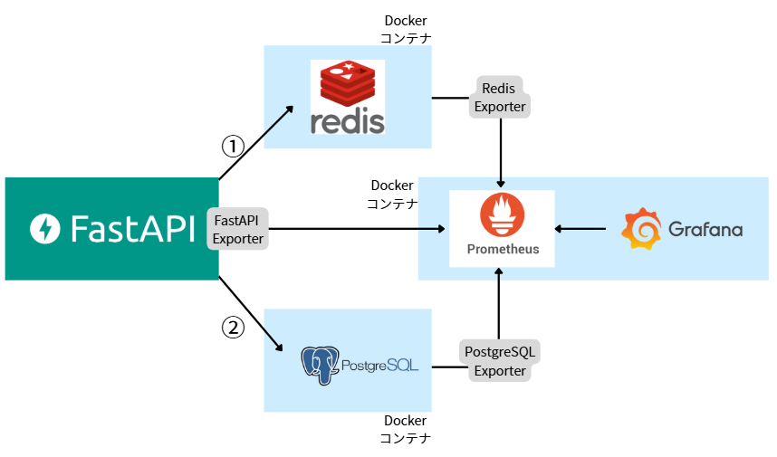
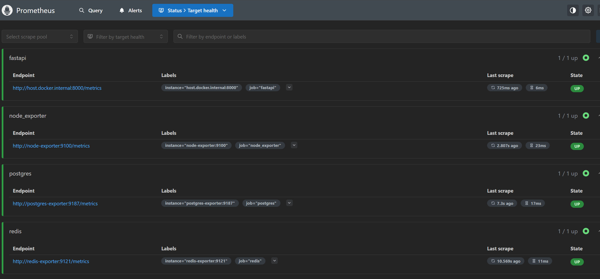
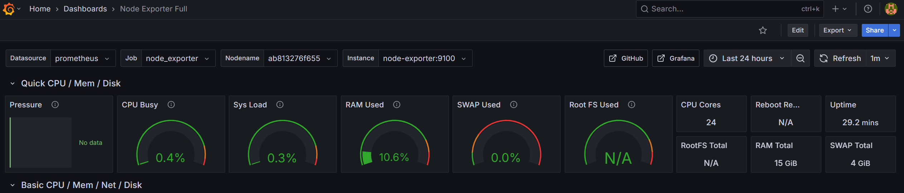
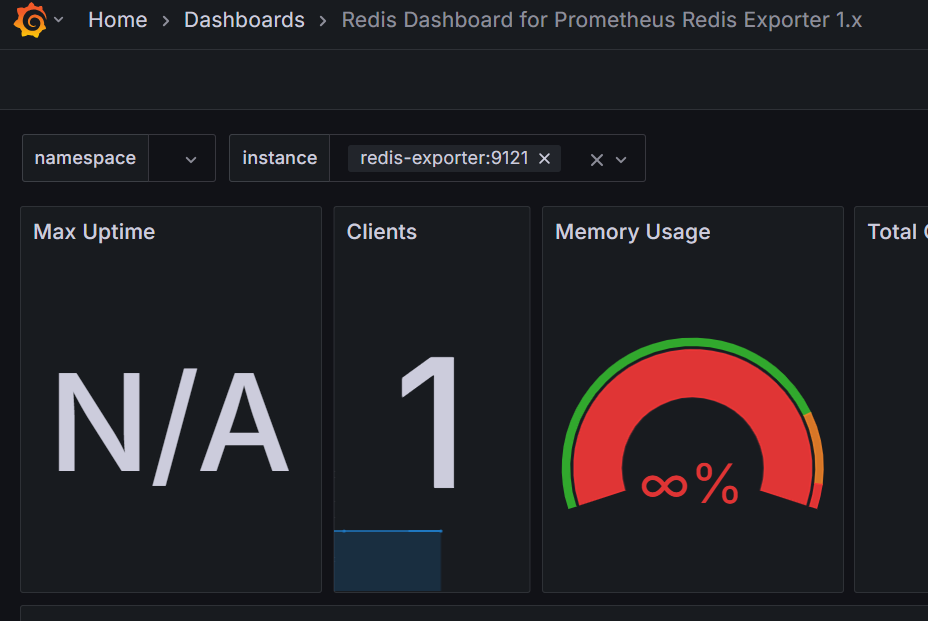

# 📄 Redis キャッシュとリソース管理設計書

## 1. 概要

本設計書は、FastAPI アプリケーションに Redis キャッシュを導入し、レスポンス性能と DB 負荷を最適化することを目的とする。
キャッシュ対象 API は、主に**頻繁に読み取られるが更新頻度が低い GET エンドポイント**とし、以下の観点で設計を行う：

- キャッシュ導入の妥当性
- キャッシュキーの粒度と TTL
- パフォーマンス向上の見込み
- リソース（メモリ/I/O）管理

---

## 2. 対象システム・構成

| 項目                   | 内容                                    |
| ---------------------- | --------------------------------------- |
| アプリケーション       | FastAPI（Python）                       |
| キャッシュバックエンド | Redis（Docker コンテナ）                |
| キャッシュライブラリ   | `fastapi-cache2` + `aioredis`           |
| DB                     | PostgreSQL                              |
| 監視ツール             | Prometheus + FastAPI Exporter + Grafana |

---

## 3. システム構成図



- クライアント（Next.js）は FastAPI にアクセス
- FastAPI は Redis を確認し、キャッシュヒット時は即レスポンス（①）
- キャッシュが無い場合は PostgreSQL に問い合わせ、結果を Redis にキャッシュ(②)
- FastAPI のメトリクスは FastAPI Exporter を通じて Prometheus が監視
- Prometheus は各 Exporter からメトリクスを収集し、Grafana がそれを可視化 → CPU やメモリ、I/O の使用状況を確認

---

## 4. キャッシュ導入対象の API

Redis キャッシュの導入にあたり、GET エンドポイントに対して以下の観点から対象を評価した：

- 副作用がない（読み取り専用）
- データの更新頻度が低い
- 読み取り頻度が書き込み頻度を大幅に上回る
- 適切なキャッシュ無効化戦略を実装可能

### 4.1 実装済みエンドポイント

| エンドポイント          | メソッド | 概要                     | キャッシュ戦略                                                      | 実装状況 |
| ----------------------- | -------- | ------------------------ | ------------------------------------------------------------------- | -------- |
| `/api/reflection_notes` | GET      | 反省文一覧取得（保護者） | ✅ Cache-Aside + Write-Through<br>TTL: 60 秒<br>POST/PATCH 後無効化 | 実装完了 |

### 4.2 検討対象外とした主要エンドポイント

| エンドポイント           | 理由                                                                             |
| ------------------------ | -------------------------------------------------------------------------------- |
| `/api/care_logs/today`   | 1 日の中で頻繁に状態変化、即時性が重要（ミッション進行状況）                     |
| `/api/care_logs/list`    | 管理者画面での反省文判定に使用、リアルタイムでの最新データが必要                 |
| `/api/care_logs/by_date` | 反省文ページへのリダイレクト判定に使用、業務ロジックの正確性が最優先             |
| `/api/care_settings/me`  | 個人設定・認証関連、セキュリティ上キャッシュ非推奨、付款後の即時 plan 反映が必要 |
| `/api/users/me`          | ユーザー認証・プラン状態、セキュリティと即時性の観点でキャッシュ非推奨           |

---

## 5. キャッシュ設計方針

### 5.1 キー戦略（cache key）

**実装例：**

```python
@cache(
    expire=60,
    key_builder=lambda func, *args, **kwargs: f"reflection_notes:{kwargs.get('firebase_uid', 'unknown')}"
)
```

**設計原則：**

- ユーザー固有性を保証（`firebase_uid`をキーに含める）
- 適切な名前空間（`reflection_notes:`プレフィックス）
- 衝突回避とデバッグ容易性を考慮

### 5.2 TTL（キャッシュ有効期限）

| エンドポイント          | TTL 秒数 | 理由                                   |
| ----------------------- | -------- | -------------------------------------- |
| `/api/reflection_notes` | 60 秒    | 反省文の読み取り頻度高、書き込み頻度低 |

---

### 5.3 キャッシュクリア戦略

**実装済み戦略：Write-Through Invalidation**

reflection_notes API では、データ書き込み後に即座にキャッシュを無効化する Write-Through Invalidation パターンを実装：

```python
# POST /api/reflection_notes - 新規反省文作成後
cache_key = f"reflection_notes:{firebase_uid}"
await FastAPICache.clear(cache_key)
print(f"キャッシュクリア完了: {cache_key}")

# PATCH /api/reflection_notes/{note_id} - 承認状態更新後
cache_key = f"reflection_notes:{firebase_uid}"
await FastAPICache.clear(cache_key)
print(f"キャッシュクリア完了: {cache_key}")
```

**戦略の特徴：**

- データ更新と同時に関連キャッシュを即座に削除
- データ一貫性を確実に保持
- 次回の GET リクエスト時に最新データを返却

---

## 6. リソース管理（メモリ・I/O）

### 6.1 キャッシュによる DB 負荷軽減の期待

| 比較項目          | キャッシュなし     | キャッシュあり                     |
| ----------------- | ------------------ | ---------------------------------- |
| DB クエリ実行回数 | 多                 | 少                                 |
| レスポンスタイム  | 300〜800ms（予想） | 10〜50ms（予想）                   |
| CPU 使用率        | 中程度             | 低減（Redis メモリ処理のため軽量） |

### 6.2 Redis のメモリ設計

- シンプルな文字列キャッシュ（JSON）
- TTL 管理による自動削除 → メモリ枯渇のリスクを最小化
- 必要に応じて `maxmemory-policy` 設定（
  例：`volatile-lru`）

---

## 7. 導入後の評価・検証

### 7.1 ベンチマーク方法

**実装済み API のテスト：**

- `/api/reflection_notes` エンドポイントのキャッシュ効果測定
- キャッシュヒット/ミス時のレスポンス時間比較
- POST/PATCH 後のキャッシュ無効化動作確認

**テスト手順：**

#### 7.1.1 キャッシュヒット/ミスの動作確認

1. **初回 GET リクエスト（キャッシュミス）**
   ```bash
   curl -X GET "http://localhost:8000/api/reflection_notes" \
        -H "Authorization: Bearer <firebase_token>" \
        -w "Time: %{time_total}s\n"
   ```
   - 期待値：300〜800ms のレスポンス時間
   - Redis にキャッシュが作成される

2. **2回目 GET リクエスト（キャッシュヒット）**
   ```bash
   # 同じリクエストを即座に実行
   curl -X GET "http://localhost:8000/api/reflection_notes" \
        -H "Authorization: Bearer <firebase_token>" \
        -w "Time: %{time_total}s\n"
   ```
   - 期待値：10〜50ms のレスポンス時間（2〜10倍の高速化）
   - Redis からキャッシュデータを返却

#### 7.1.2 キャッシュ無効化の動作確認

3. **POST でデータ作成後の GET（キャッシュクリア確認）**
   ```bash
   # 新規反省文を作成
   curl -X POST "http://localhost:8000/api/reflection_notes" \
        -H "Authorization: Bearer <firebase_token>" \
        -H "Content-Type: application/json" \
        -d '{"content": "テスト反省文", "care_log_id": 1}'
   
   # 即座に GET リクエスト（キャッシュがクリアされているか確認）
   curl -X GET "http://localhost:8000/api/reflection_notes" \
        -H "Authorization: Bearer <firebase_token>" \
        -w "Time: %{time_total}s\n"
   ```
   - 期待値：新規作成されたデータが含まれるレスポンス
   - レスポンス時間は初回同様（300〜800ms）

4. **PATCH で承認状態更新後の GET（キャッシュクリア確認）**
   ```bash
   # 反省文の承認状態を更新
   curl -X PATCH "http://localhost:8000/api/reflection_notes/1" \
        -H "Authorization: Bearer <firebase_token>" \
        -H "Content-Type: application/json" \
        -d '{"is_approved": true}'
   
   # 即座に GET リクエスト（キャッシュがクリアされているか確認）
   curl -X GET "http://localhost:8000/api/reflection_notes" \
        -H "Authorization: Bearer <firebase_token>" \
        -w "Time: %{time_total}s\n"
   ```
   - 期待値：承認状態が更新されたデータを返却
   - レスポンス時間は初回同様（300〜800ms）

#### 7.1.3 Redis での確認方法

```bash
# Redis CLI でキャッシュキーの確認
docker exec -it <redis_container_name> redis-cli

# キャッシュキーの存在確認
KEYS "reflection_notes:*"

# TTL の確認
TTL "reflection_notes:<firebase_uid>"

# キャッシュデータの確認
GET "reflection_notes:<firebase_uid>"
```

### 7.2 効果測定指標

| 指標                 | 測定対象                        | 期待値                     | 実装状況                              |
| -------------------- | ------------------------------- | -------------------------- | ------------------------------------- |
| 平均レスポンスタイム | `/api/reflection_notes`         | キャッシュヒット時 10-50ms | 手動テストで測定可能                  |
| キャッシュ効果       | 2 回目リクエストの速度向上      | 初回比 2-10 倍高速化       | 手動テストで計測                      |
| データ一貫性         | POST/PATCH 後のキャッシュクリア | 即座に最新データを返却     | ✅ 実装完了・ログで確認可能           |
| Redis 動作確認       | キャッシュキーの TTL 管理       | 60 秒で自動削除            | Redis CLI で `TTL` コマンドで確認可能 |

---

## 8. リソース監視の導入（Prometheus + Grafana）

- Node Exporter によって、CPU・メモリ・ネットワーク等の使用状況を収集

- Prometheus でメトリクスを取得し、Grafana ダッシュボードで可視化

- 開発中のボトルネックの特定や、キャッシュ導入後の効果測定に活用

- Prometheus のターゲット確認
  

- Node Exporter のダッシュボード画面で CPU やメモリ監視
  

- Redis のダッシュボード画面（∞％メモリ使用など）
  

---

## 9. まとめ

Redis キャッシュは、ユーザー別・日付別の履歴取得など「参照回数が多く、更新頻度の低い」API に対し、有効に機能する。

本設計では TTL とキー粒度を適切に設計することで、メモリ/I/O バランスも保ちながら、全体のパフォーマンス改善が見込まれる。

今後は、更新系処理に連動したキャッシュ削除の自動化や、Redis メモリの使用状況モニタリングなど、運用面の強化も視野に入れる。

---

本設計および検証は、開発チーム内でのパフォーマンス改善の知見共有および今後の運用フェーズへのスムーズな移行を目的としています。

---

## 10. 起動手順・再現方法

### 10.1 前提

- Docker / Docker Compose がインストールされていること
- `redis`, `postgres`, `prometheus.yml`, `alert_rules.yml` などがすべてプロジェクトルートに揃っていること

### 10.2 起動コマンド

```bash
# コンテナを起動（初回ビルド）
docker-compose up --build -d
```

# Prometheus → http://localhost:9090

# Grafana → http://localhost:3001（admin/admin）

# FastAPI → http://localhost:8000/docs

### 10.3 Grafana 設定

初回ログイン後、以下を設定：

- Data Source: Prometheus → http://prometheus:9090
- ダッシュボード：Node Exporter / Redis Exporter の公式テンプレートをインポート

---

## 11. 参考リンク・資料

- [fastapi-cache2 GitHub](https://github.com/long2ice/fastapi-cache)
- [Prometheus Exporters](https://prometheus.io/docs/instrumenting/exporters/)
- [Grafana Dashboards](https://grafana.com/grafana/dashboards/)
